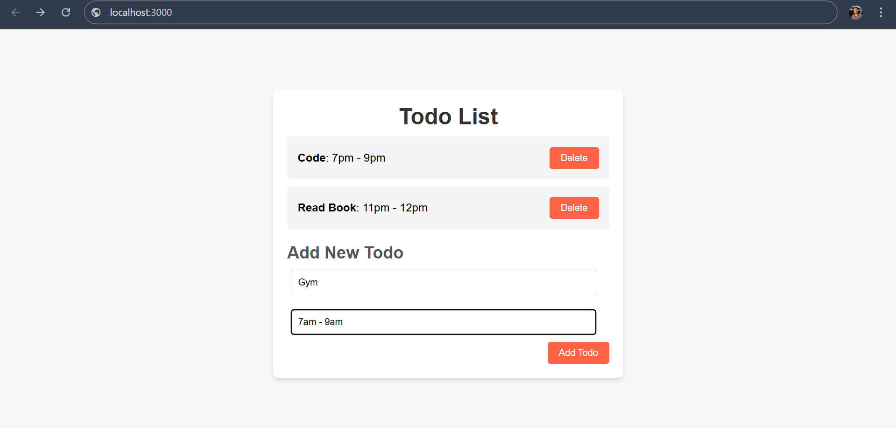
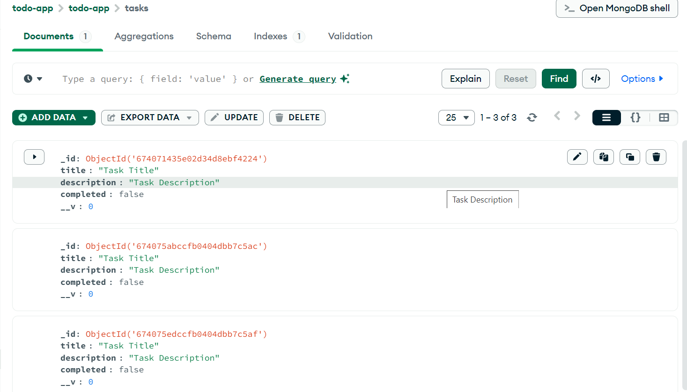

# Todo List Application

This project is a simple **Todo List Application**. The application allows users to add, view, and delete tasks, each with a title and description. All tasks are stored in **MongoDB**.

## Screenshots

### Frontend (Todo List Display)

It shows the frontend of the Todo List application, displaying the tasks with their titles and descriptions.



### MongoDB Compass (Backend)

It shows the MongoDB Compass view, where the Todo tasks are stored in the `todos` collection within the `todo-app` database.



## Features

- **Add Todo**: Users can add tasks with a title and description.
- **Delete Todo**: Users can remove tasks from the list.
- **Persistent Storage**: Data is stored in MongoDB, allowing the tasks to persist.
- **Frontend Display**: A simple and responsive frontend displays all the tasks in a list format.

## Technologies Used

- **Backend**: Node.js, Express.js
- **Database**: MongoDB (MongoDB Compass for database management)

## Setup Instructions

### 1. Clone the Repository

```bash
git clone https://github.com/your-username/todo-list.git
cd todo-list

2. Install Dependencies
Make sure you have Node.js installed on your system. Then, run the following command to install all necessary dependencies: npm install


3. Configure MongoDB
You can set up MongoDB either locally or use MongoDB Atlas for a cloud database.

For local MongoDB, use the following URL in your app.js file: mongodb://localhost:27017/todo-app

For MongoDB Atlas, replace it with the appropriate connection string provided by Atlas.

4. Start the Application
After installing dependencies and configuring MongoDB, run the following command to start the server: node app.js

This will start the server, and you should be able to access the Todo List app at http://localhost:3000.

5. Using the Application
Add a Task: Fill in the form with a title and description, then click the "Add Todo" button to submit the task.
Delete a Task: Click the "Delete" button next to a task to remove it from the list.

Conclusion
This Todo List application provides a simple and functional way to manage tasks with a basic backend in Node.js and a MongoDB database. It supports adding, viewing, and deleting tasks.

Feel free to fork this repository and modify it for your own projects!
